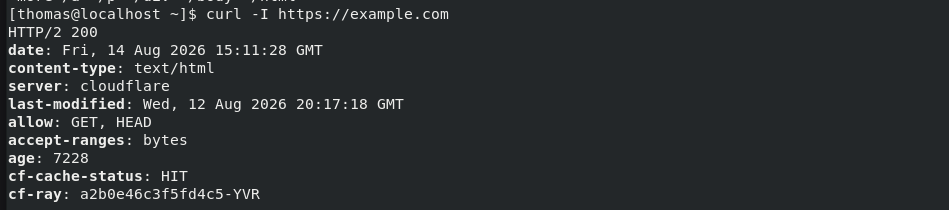
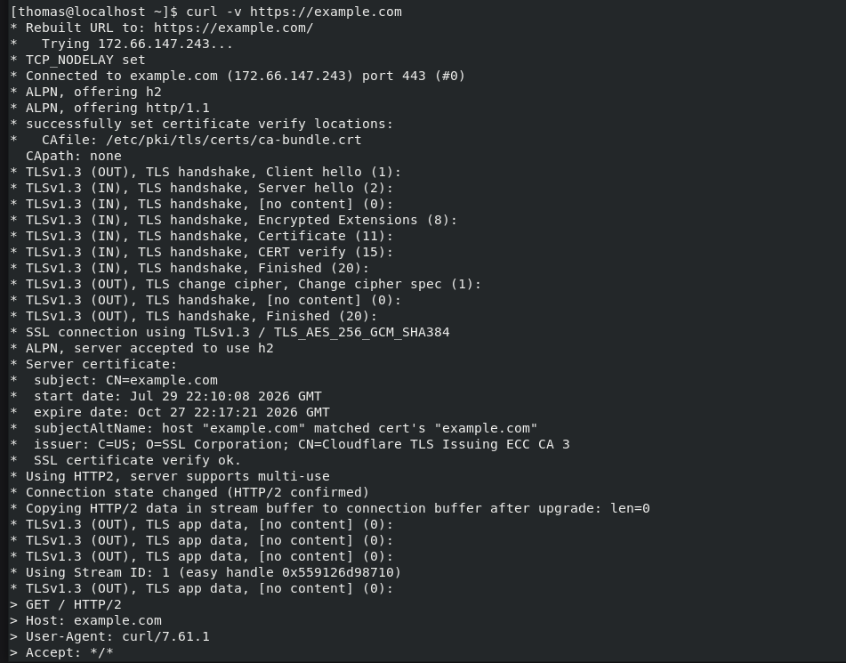
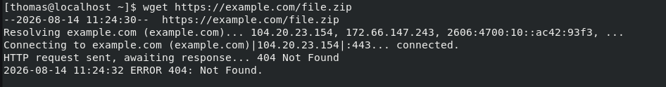
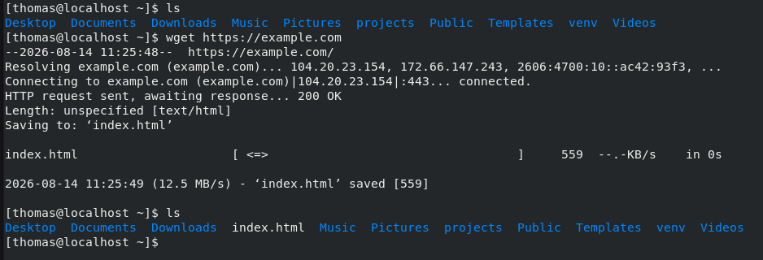

# curl and wget

## Overview

`curl` and `wget` are command-line tools used to communicate with web servers and retrieve content over protocols such as HTTP and HTTPS.

`curl` is particularly useful for network and application troubleshooting because it can display HTTP headers, connection details, TLS negotiation, HTTP status codes, and error information.

`wget` is primarily designed to retrieve and save files or web content.

Together, these tools can help verify connectivity beyond basic network-layer tests such as `ping`.


## Usage

Use `curl` to:

* Test HTTP and HTTPS connectivity
* Verify that a web server responds
* Check HTTP status codes
* Display HTTP response headers
* Troubleshoot DNS resolution
* Test TCP connectivity to a web service
* Examine TLS certificate negotiation
* View detailed HTTP request and response information

Use `wget` to:

* Download files from a URL
* Retrieve web content
* Verify that a remote resource can be downloaded
* Save retrieved content locally
* Identify HTTP errors during a download attempt

These tools test communication at the application layer. A system may successfully respond to `ping` while an HTTP or HTTPS service remains unavailable.


## Key Concepts

### HTTP and HTTPS

HTTP is an application-layer protocol used to exchange web content between clients and servers.

HTTPS uses HTTP over an encrypted TLS connection.

Common ports are:

| Protocol | Default Port |
| -------- | -----------: |
| HTTP     |       TCP 80 |
| HTTPS    |      TCP 443 |

### HTTP Request and Response

A client such as `curl` sends an HTTP request to a server.

For example:
```
GET / HTTP/2
Host: example.com
```

The server then returns an HTTP response containing a status code, headers, and optionally content.

### HTTP Status Codes

HTTP status codes indicate the result of a request.

Common examples include:

| Code                        | Meaning                                          |
| --------------------------- | ------------------------------------------------ |
| `200 OK`                    | Request succeeded                                |
| `301 Moved Permanently`     | Resource has permanently moved                   |
| `302 Found`                 | Resource is temporarily available elsewhere      |
| `403 Forbidden`             | Server understood the request but refuses access |
| `404 Not Found`             | Requested resource was not found                 |
| `500 Internal Server Error` | Server encountered an internal error             |
| `503 Service Unavailable`   | Service is temporarily unavailable               |

An HTTP error is different from a network connectivity failure. For example, receiving `404 Not Found` demonstrates that communication with the web server succeeded, but the requested resource does not exist.

### DNS Resolution

Before connecting to a hostname such as:
`example.com`


the client normally resolves the hostname to an IP address.  

A DNS failure can therefore prevent an HTTP connection from being attempted.  

### TCP Connection  

After resolving the hostname, the client establishes a TCP connection to the web server.  

For HTTPS, this normally means connecting to TCP port 443.  

A connection failure at this stage may indicate:  

* The service is not listening  
* The port is blocked  
* The destination is unreachable  
* A firewall is rejecting the connection  

### TLS

HTTPS uses Transport Layer Security (TLS) to encrypt communication.  

During TLS negotiation, the client and server establish encryption parameters and the server presents its digital certificate.    

`curl -v` can display information about this process, including:  

* TLS version
* Certificate verification
* Certificate subject
* Certificate issuer
* Negotiated protocol

### curl vs. wget

Although both tools can retrieve web content, their typical purposes differ:  

* `curl` is suited to testing and interacting with network services and APIs.  
* `wget` is suited to downloading files and web content to disk.  

---

## Common Commands

1. **Retrieve a Web Page**  
`curl https://example.com`  
Retrieves the resource and writes the response body to standard output.  

For an HTML page, the HTML source is displayed directly in the terminal.  

2. **Display HTTP Headers**  
`curl -I https://example.com`  
Retrieves response headers without displaying the normal response body.  

This is useful for quickly checking:  

* HTTP status
* Content type
* Server information
* Redirects
* Caching information

3. **Display Verbose Connection Information**  
`curl -v https://example.com`  
Displays detailed information about the connection, including DNS resolution, TCP connection establishment, TLS negotiation, certificate verification, and HTTP communication.  
Verbose mode is particularly useful for troubleshooting.  

4. **Follow Redirects**  
`curl -L http://example.com`  

Follows HTTP redirects until the final destination is reached.  

5. **Save Output to a File**  
`curl -o page.html https://example.com`  
Saves the response body as `page.html` instead of displaying it in the terminal.  

6. **Download Content with 'wget'**  
`wget https://example.com`  
Downloads the requested resource and saves it locally.  

7. **Download a Specific File**  
`wget https://example.com/file.zip`  
Attempts to download the specified resource.  

If the resource does not exist, the server may return an HTTP error such as `404 Not Found`.


## Practical Examples

### Verify Web Server Connectivity
`curl https://example.com`

  

A successful request returns the web page content.

This demonstrates that several underlying operations succeeded:

1. The hostname was resolved.
2. A connection to the remote web server was established.
3. HTTPS communication succeeded.
4. The server processed the HTTP request.
5. Application content was returned.

This provides more information about application availability than a basic `ping` test.

### Check HTTP Response Headers

`curl -I https://example.com`

  

`200` indicates that the HTTP request succeeded.

Examining headers provides a quick way to verify that a web service is responding without displaying the complete page content.

### Troubleshoot an HTTPS Connection

`curl -v https://example.com`

  

Verbose output shows the stages involved in establishing the connection.


This demonstrates that:

* DNS resolution returned an IP address
* A TCP connection to port 443 succeeded
* TLS negotiation completed
* The server certificate was successfully verified
* An HTTP request was sent

This makes `curl -v` useful for identifying approximately where an HTTPS connection is failing.

### Identify a DNS Resolution Failure


`curl -v https://example.invalid`
  

Example:

This indicates that hostname resolution failed.

The failure occurs before a TCP connection to a web server can be established.

DNS configuration can then be investigated using tools such as `dig` or `nslookup`.

### Identify a Refused TCP Connection
`curl -v http://127.0.0.1:9999`

  

A connection refusal indicates that the destination host was reached but the TCP connection was rejected.

In this example, no service is accepting the connection on TCP port 9999.

This differs from a timeout, where a response to the connection attempt is not received.

The local listening sockets could be checked with:

`ss -ltn`

### Identify an HTTP 404 Error

`wget https://example.com/file.zip`

  


DNS resolution and the connection to the HTTPS server succeeded. The server also processed the HTTP request and returned a response.

The problem is at the HTTP/application level: the requested resource does not exist at that location.

### Download Web Content

`wget https://example.com`

  

A successful download demonstrates that the remote resource was reached and saved to the local filesystem.

The downloaded file can be verified with:
`ls`

This illustrates the primary difference between the default behavior of `curl` and `wget`: `curl` normally writes retrieved content to standard output, while `wget` normally saves downloaded content to a file.
