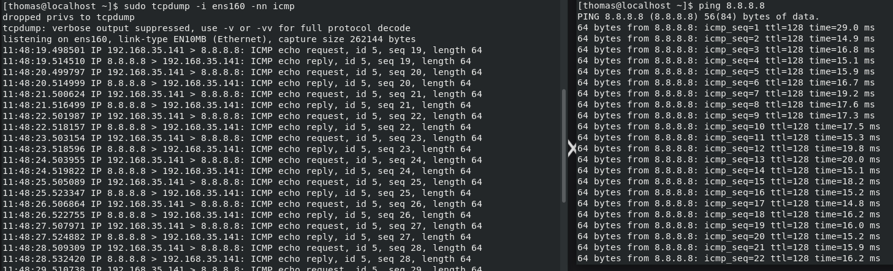

#tcpdump

## Overview
`tcpdump` is a command-line packet capture and network analysis tool used to inspect traffic passing through a Linux system.

It can capture packets from a specific network interface and filter traffic by protocol, host, or port. It is useful for determining whether network traffic is reaching or leaving a system and for troubleshooting DNS, web, SSH, and other network connections.

## Key Concepts

- **Packet Capture** - `tcpdump` captures packets that pass through a selected network interface. This allows traffic to be examined as it enters or leaves the system.  
- **Network Interfaces** - Traffic must be captured from the correct interface, such as `ens160`, `eth0`, or `wlan0`.  Available capture interfaces can be displayed with: `sudo tcpdump -D`  
- **Capture Filters** - Filters limit the packets displayed or captured, making it easier to isolate relevant traffic.  
    Common filters include:  
        - `host` — traffic to or from a specific host  
        - `port` — traffic using a specific port  
        - `tcp` — TCP traffic  
        - `udp` — UDP traffic  
        - `icmp` — ICMP traffic  
- **Source and Destination** - Each packet identifies where the traffic originated and where it is going.  
    source IP.source port > destination IP.destination port  
    `192.168.35.141.51824 > 142.250.69.100.443`  
    This represents traffic from source port 51824 on the local system to HTTPS port 443 on the remote system.

- **TCP Flags** - TCP flags help identify the state of a TCP connection.
    For example, the beginning of a successful TCP connection normally shows:
        `SYN →`
        `← SYN-ACK`
        `ACK →`
    This is the TCP three-way handshake.

  

## Usage
Use `tcpdump` to:

- Verify that packets are arriving at or leaving a system
- Capture traffic on a specific network interface
- Troubleshoot DNS queries and responses
- Inspect TCP connection attempts
- Capture HTTP or HTTPS traffic
- Filter traffic by protocol, host, or port
- Create packet capture files for later analysis in Wireshark

`tcpdump` normally requires root privileges, so it is commonly run with `sudo`.

## Common Commands

1. **List Available Interfaces** - Displays the network interfaces available for packet capture.  
`sudo tcpdump -D`  

2. **Capture Traffic on an Interface** - Captures packets on the ens160 interface.  
`sudo tcpdump -i ens160`  

3. **Disable Name Resolution** - The -n option prevents IP addresses from being converted to hostnames, making the output faster and easier to interpret during troubleshooting.  
`sudo tcpdump -i ens160 -n`

4. **Capture Traffic for a Specific Host** - Displays packets where 8.8.8.8 is either the source or destination.
`sudo tcpdump -i ens160 -n host 8.8.8.8`

5. **Capture Traffic for a Specific Port** - Captures traffic using TCP or UDP port 443.
`sudo tcpdump -i ens160 -n port 443`

6. **Capture DNS Traffic** - Captures DNS queries and responses.
`sudo tcpdump -i ens160 -n port 53`

7. **Capture HTTP Traffic** - Captures unencrypted HTTP traffic on TCP port 80.
`sudo tcpdump -i ens160 -n tcp port 80`

8. **Capture HTTPS Traffic** - Captures HTTPS traffic. The packet metadata can be inspected, but the application data is normally encrypted by TLS.
`sudo tcpdump -i ens160 -n tcp port 443`

10. **Save a Packet Capture** - Writes captured packets to a .pcap file that can later be opened with Wireshark.
`sudo tcpdump -i ens160 -w capture.pcap`

Stop a running capture with Ctrl+C.

## Practical Examples

`tcpdump` results while pinging remote server

  

