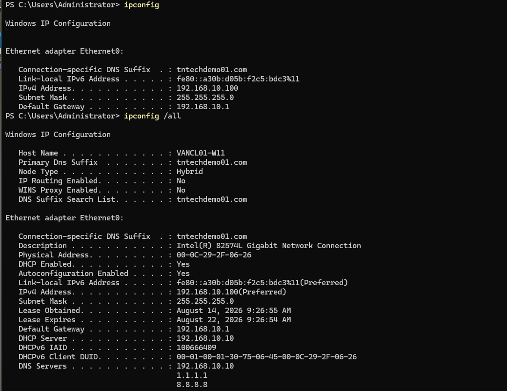
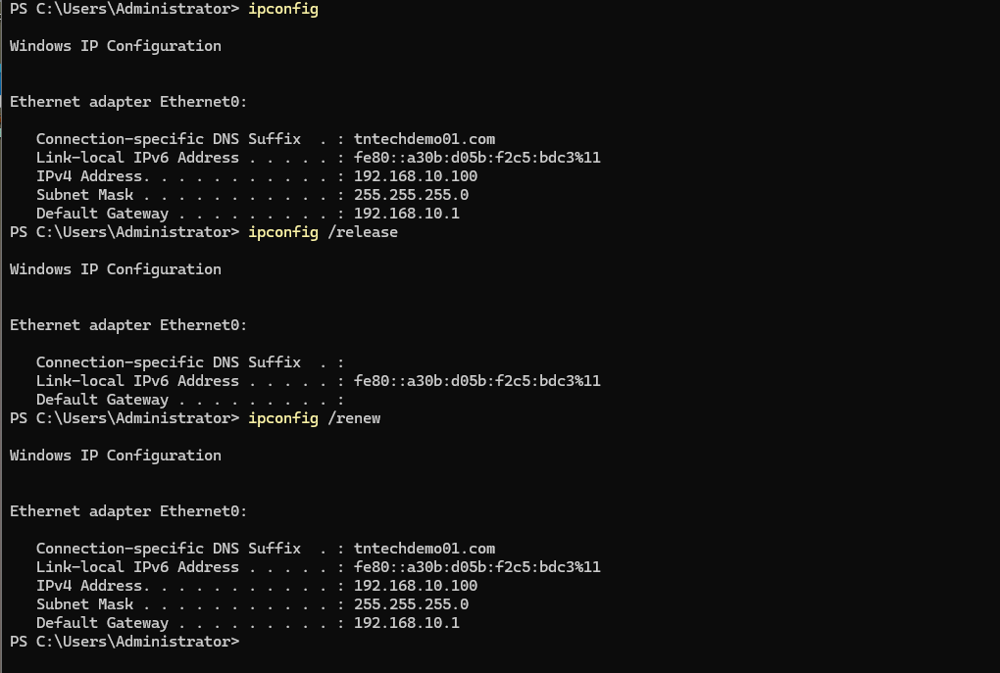

## Overview

DHCP (Dynamic Host Configuration Protocol) is a network tool that automatically gives an IP address, subnet mask, and gateway to a Windows computer. `ipconfig` command is used to view or reset these DHCP network settings.  
Key concepts:
- DHCP gives a DHCP-enabled computer an IP address without user input.
- Lease system is used for the IP address for a set time.
- Conflicts are prevented because DHCP stops two computers from using the same IP address.

## Usage 
- No IP address assigned
- Wrong IP configuration
- Cannot reach the network after moving to another VLAN
- Renewing an expired lease

## Common Commands

1. Displays basic TCP/IP configuration for network adapters, including the IPv4/IPv6 addresses, subnet mask, and default gateway.

`ipconfig`

2. Displays detailed adapter configuration, including MAC address, DHCP status and server, DNS servers, and DHCP lease information.

`ipconfig /all`

3. Releases the current DHCP-assigned IPv4 configuration for the network adapter.

`ipconfig /release`

4. Requests a DHCP lease from the DHCP server and updates the adapter's IPv4 configuration.

`ipconfig /renew`

5. Clears cached DNS records on the local computer, which can help troubleshoot outdated or incorrect name-resolution results.

`ipconfig /flushdns`

6. Initiates dynamic registration of the computer's DNS names and IP addresses with its configured DNS server.

`ipconfig /registerdns`

## Practical Examples

View basic network configuration using `ipconfig` and detailed configuration using `ipconfig /all`.
The Windows client is a VMWare machine from a lab.  

  

Release and renew a DHCP lease using `ipconfig /release` and `ipconfig /renew`. 
The `192.168.10.100` address shown below was dynamically assigned by the Windows 
DHCP Server configured in my [AD–Entra Hybrid Identity Lab](https://github.com/tjnieradka/AD-Entra-Lab/blob/main/docs/04-DHCP-Server-Setup.md).

## Troubleshooting
- Missing IPv4 address
- APIPA address (169.254.x.x)
- Incorrect gateway
- Incorrect DNS server
- Lease renewal failure
