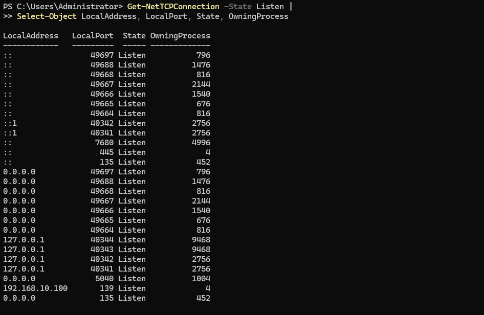
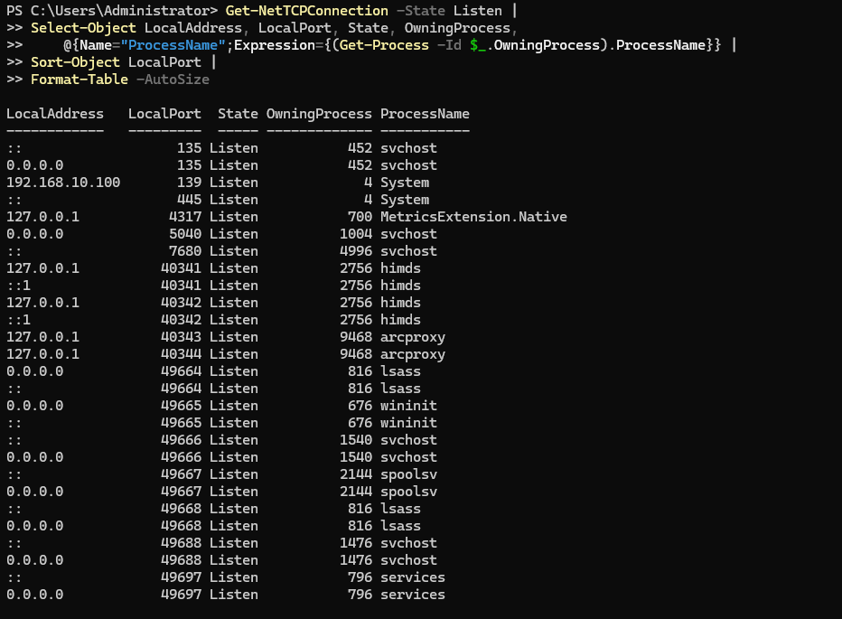
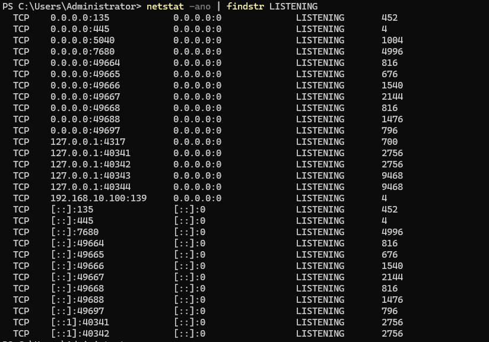

## Overview

`Get-NetTCPConnection` displays current TCP connections and listening ports on a Windows system. It can be used to examine local and remote addresses and ports, connection states, and the processes associated with TCP connections.

## Key Concepts
- **LocalAddress** — IP address on the local computer associated with the TCP connection or listening endpoint.
- **LocalPort** — TCP port used on the local computer.
- **RemoteAddress** — IP address of the remote system associated with an active connection.
- **RemotePort** — TCP port used by the remote system.
- **State** — Current state of the TCP connection, such as Listen, Established, or TimeWait.
- **OwningProcess** — Process ID (PID) of the process associated with the TCP connection or listening endpoint.
- **`0.0.0.0`** — The service is listening on all available IPv4 interfaces.
- **`::`** — The service is listening on IPv6 interfaces rather than a single specific IPv6 address.
- **Loopback (127.0.0.1 / ::1)** — The service is listening locally and is accessible only from the same computer when specifically bound to loopback.


## Usage

Use `Get-NetTCPConnection` to:

- **Identify listening services** — verify that an application or service is listening on the expected TCP port.
- **View established connections** — identify active TCP sessions between the local computer and remote systems.
- **Investigate unexpected connections** — examine unfamiliar remote addresses, ports, or connection states.
- **Troubleshoot application connectivity** — determine whether a problem involves a service that is not listening on the expected port.
- **Examine TCP connection states** — identify connections in states such as Listen, Established, and TimeWait.
- **Identify owning processes** — use the OwningProcess property with Get-Process to determine which process is associated with a connection.

## Common Commands

1. **Display all TCP connections**  — Displays current TCP connections and listening ports.  
`Get-NetTCPConnection`

2. **Display listening TCP ports** —  Filters the results to TCP endpoints currently in the Listen state.  
`Get-NetTCPConnection -State Listen`

3. **Filter by local port** — Displays TCP connections associated with a specified local port.  
`Get-NetTCPConnection -LocalPort 443`

4. **Filter by remote address** — Displays TCP connections associated with a specified remote IP address.  
`Get-NetTCPConnection -RemoteAddress 192.168.1.25`

5. **Identify processes associated with listening ports** — Displays listening ports with their owning process IDs and resolves the IDs to process names.  
```
Get-NetTCPConnection -State Listen |
Select-Object LocalAddress, LocalPort, State, OwningProcess,
    @{Name="ProcessName";Expression={(Get-Process -Id $_.OwningProcess).ProcessName}} |
Sort-Object LocalPort |
Format-Table -AutoSize
```
6. **Display TCP connections using `netstat`** — `netstat` is a command-line alternative for examining network connections. The `-a` option displays all connections and listening ports, `-n` displays addresses and ports numerically, and `-o` displays the owning process ID.
`netstat -ano`  
`netstat -ano | findstr LISTENING`

## Practical Examples

View current listening  TCP connections using `Get-NetTCPConnection`.
  
  

View current listening TCP connections with processes using `Get-NetTCPConnection`.

  


View current listening TCP connections with processes using `netstat -ano`.

  


