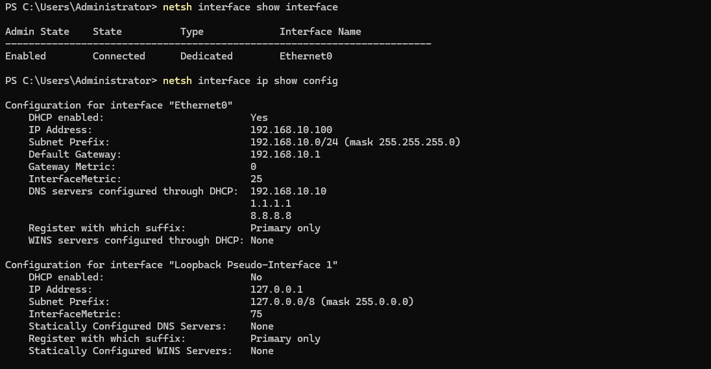

## Overview

`netsh` (Network Shell) is a Windows command-line utility used to view, configure, and troubleshoot network components. It can manage network interfaces, TCP/IP settings, Windows Firewall, Winsock, and wireless networking.

Many `netsh` functions now have PowerShell equivalents, but `netsh` remains useful for troubleshooting, legacy administration, and working with existing support procedures and documentation.

## Key Concepts

- **Network interfaces** — `netsh` can display and configure network adapters and their status.
- **TCP/IP configuration** — Interface addressing and other TCP/IP settings can be viewed or modified.
- **Windows Firewall** — Firewall profiles and rules can be examined and configured.
- **Winsock** — The Windows Sockets catalog provides interfaces used by applications for network communication.
- **Network stack reset** — Some `netsh` commands modify or reset networking components and should be used as remediation steps rather than initial diagnostic steps.

## Usage

Use `netsh` to:

- Examine network interfaces and IP configuration.
- Check Windows Firewall profiles and configuration.
- Troubleshoot TCP/IP or Winsock problems.
- Perform network-stack remediation when less disruptive troubleshooting has not resolved the problem.
- Examine wireless interfaces and configuration.

## Common Commands

1. **Display Network Interfaces** — Displays network interfaces and their administrative and connection states.  
`netsh interface show interface`

2. **Display IP Configuration** — Displays TCP/IP configuration for network interfaces.  
`netsh interface ip show config`  

3. **Display the Active Windows Firewall Profile** — Displays the firewall profile currently applied to the computer, including its state and default inbound/outbound policy.  
`netsh advfirewall show currentprofile`

4. **Display All Windows Firewall Profiles** — Displays configuration for the Domain, Private, and Public firewall profiles.  
`netsh advfirewall show allprofiles`

5. **Reset TCP/IP** — Resets TCP/IP configuration components. This is a remediation command that may be useful when troubleshooting persistent network-stack problems.  
`netsh int ip reset`  
A restart may be required after performing the reset.  

6. **Reset Winsock** — Resets the Winsock catalog when troubleshooting persistent socket or network communication problems.  
`netsh winsock reset`  
A restart may be required after performing the reset.  

## PowerShell Alternatives

There is no single PowerShell command that replaces `netsh`. Windows provides different PowerShell cmdlets for specific networking functions.

Task | `netsh` | PowerShell
-----|---------|------------
View network adapters |	`netsh interface show interface` |	`Get-NetAdapter`
View IP configuration	| `netsh interface ip show config` | `Get-NetIPConfiguration`
View IP addresses	| `netsh interface ip show addresses` |	`Get-NetIPAddress`
View firewall profiles |	`netsh advfirewall show allprofiles` |	`Get-NetFirewallProfile`
View firewall rules |	`netsh advfirewall firewall show rule name=all` | `Get-NetFirewallRule`

## Practical Examples

View basic network interface configuration using netsh`.  

  

