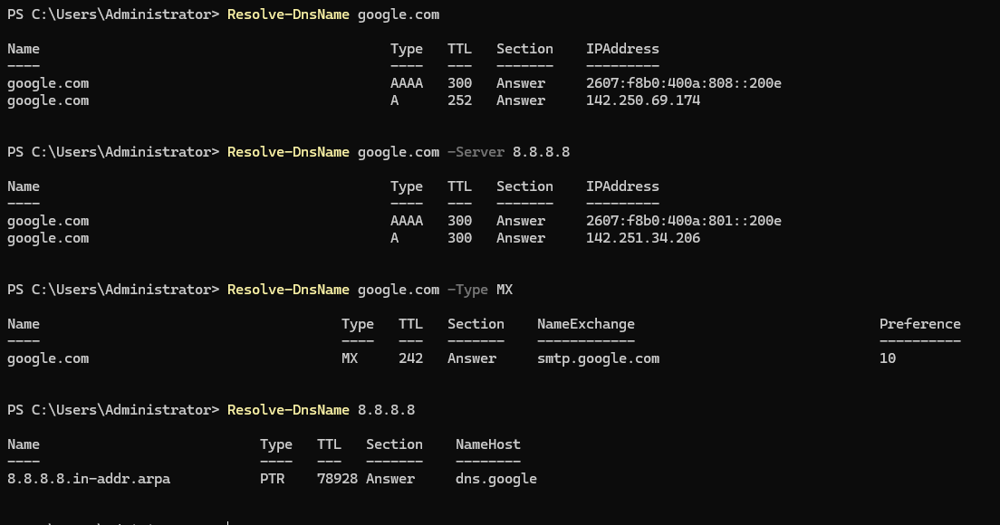

## Overview

`Resolve-DnsName` is a PowerShell cmdlet used to query DNS servers and retrieve DNS record information. It can perform forward and reverse lookups, query specific DNS record types, and send queries to a specified DNS server.

It provides a PowerShell-based alternative to traditional tools such as `nslookup`.

## Key Concepts

- **A record** — Maps a hostname to an IPv4 address.
- **AAAA record** — Maps a hostname to an IPv6 address.
- **MX record** — Identifies the mail server responsible for receiving email for a domain.
- **PTR record** — Maps an IP address back to a hostname and is used for reverse DNS lookups.
- **TTL (Time to Live)** — Specifies how long a DNS record can be cached before it should be queried again.
- **DNS server** — The server that receives the DNS query and returns or obtains the requested DNS information.

Common fields in `Resolve-DnsName` output include:

- **Name** — Name associated with the DNS record.
- **Type** — DNS record type, such as `A`, `AAAA`, `MX`, or `PTR`.
- **IPAddress** — IPv4 or IPv6 address returned by an address lookup.
- **TTL** — Remaining cache lifetime of the DNS record, in seconds.
- **NameHost** — Hostname returned by records such as a PTR lookup.

## Usage

Use `Resolve-DnsName` to:

- **Verify name resolution** — confirm that a hostname resolves to the expected IP address.
- **Investigate name-resolution failures** — determine whether DNS is responsible for a connectivity problem.
- **Query specific DNS records** — examine records such as `A`, `AAAA`, `MX`, and `PTR`.
- **Query a specific DNS server** — compare results from different DNS servers or bypass the system's configured resolver for testing.
- **Perform reverse lookups** — determine whether an IP address has an associated PTR record.
- **Investigate incorrect or stale DNS information** — compare returned records, addresses, and TTL values.

## Common Commands

1. **Perform a Forward DNS Lookup** — Resolves a hostname and displays the DNS records returned for the name.  
`Resolve-DnsName google.com`  

2. **Query a Specific DNS Server** — Sends the DNS query to a specified DNS server rather than relying on the system's configured DNS resolver.  
`Resolve-DnsName google.com -Server 8.8.8.8`  

This can be useful when comparing DNS responses or determining whether a problem is specific to a particular DNS server.  

3. **Query MX Records** — Requests the mail exchanger records associated with a domain.  
`Resolve-DnsName google.com -Type MX`  

4. **Perform a Reverse DNS Lookup** — Queries for a PTR record associated with an IP address.  
`Resolve-DnsName 8.8.8.8`  

A successful reverse lookup can return the hostname associated with the address.  

## Practical examples

View DNS configuration using `Resolve-DNSName` 

  

