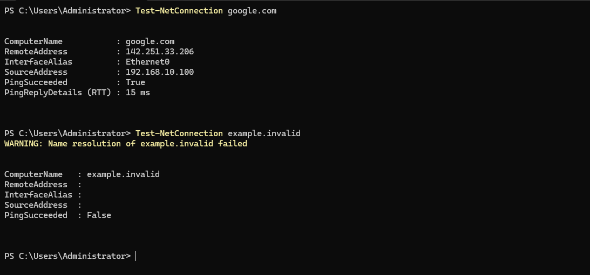
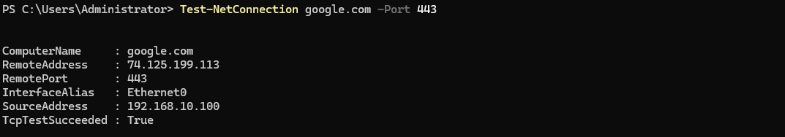
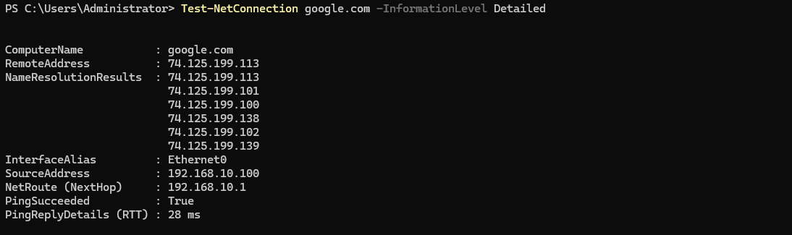
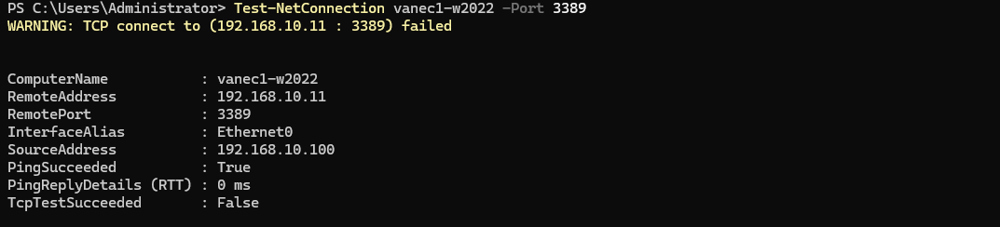

## Overview

`Test-NetConnection` is a PowerShell cmdlet used to test network connectivity between a Windows system and a remote host. It can perform ICMP connectivity tests, test TCP ports, resolve hostnames, and provide information about the network interface and route used to reach a destination.

It combines several useful connectivity tests in a single PowerShell command and can help determine whether a problem involves basic network reachability or access to a specific TCP service.

## Key Concepts

- **PingSucceeded** — Indicates whether the remote host responded to an ICMP echo request.
- **TcpTestSucceeded** — Indicates whether a TCP connection could be established to the specified remote port.
- **RemoteAddress** — IP address to which the destination hostname resolved.
- **RemotePort** — TCP port tested when the `-Port` parameter is specified.
- **InterfaceAlias** — Local network interface used for the connection.
- **SourceAddress** — Local IP address used to reach the destination.
- **NameResolutionResults** — Displays addresses returned when resolving the destination hostname in detailed output.

A successful ICMP test confirms basic IP reachability but does not confirm that a particular application or service is available. Testing the required TCP port provides a more specific connectivity test.

## Usage

Use `Test-NetConnection` to:

- **Verify basic network connectivity** — determine whether a remote host responds to ICMP.
- **Test TCP port connectivity** — determine whether a specific TCP service can be reached.
- **Verify name resolution** — confirm that a hostname resolves to an IP address before testing connectivity.
- **Troubleshoot application connectivity** — distinguish between a reachable host and an inaccessible application port.
- **Investigate firewall issues** — determine whether connectivity to a required TCP port is failing.
- **Examine the network path** — identify the local interface and source address used to reach a destination.

ICMP and TCP tests should be interpreted separately. A host may block ICMP while still accepting TCP connections, and a successful ping does not mean that a required application port is available.

## Common Commands

1. **Test Basic Connectivity** — Tests name resolution and ICMP connectivity to a remote host.  
`Test-NetConnection google.com`  

2. **Test a Specific TCP Port** — Tests whether a TCP connection can be established to a specified port.  
`Test-NetConnection google.com -Port 443`  

This can help determine whether an application service is reachable rather than relying only on ICMP connectivity.  

3. **Display Detailed Connectivity Information** — Displays additional information about name resolution, network interfaces, and routing.  
`Test-NetConnection google.com -InformationLevel Detailed`  

4. **Test Remote Desktop Connectivity** — Tests whether the Remote Desktop TCP port can be reached on a remote Windows system.  
`Test-NetConnection server01 -Port 3389`  

A result where PingSucceeded is True but TcpTestSucceeded is False indicates that the host is reachable but a TCP connection to port 3389 could not be established.

5. **Trace the Network Path** — Traces the network path toward a remote destination and displays the intermediate hops that respond.
`Test-NetConnection google.com -TraceRoute`

## Practical Examples

Test basic network connection using `Test-NetConnection`.  

  

Test basic network connection using `Test-NetConnection` on specific port.  

  

Test basic network connection using `Test-NetConnection` with detailed information.
 
  

Test basic network connection using `Test-NetConnection` to a remote computer on Remote Desktop port

  

In this example, the following possibilities exist 
- Remote Desktop is disabled on vanec1-w2022.
- RDP is enabled, but Windows Firewall is blocking TCP 3389.
- The Remote Desktop service is not running/listening.
- RDP has been configured to use a different port.
- Some other network/firewall control between the machines is blocking 3389.

---

