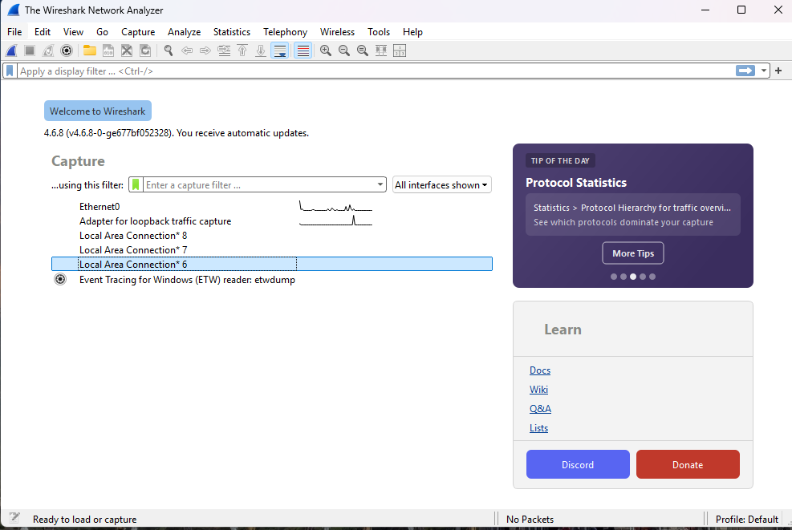
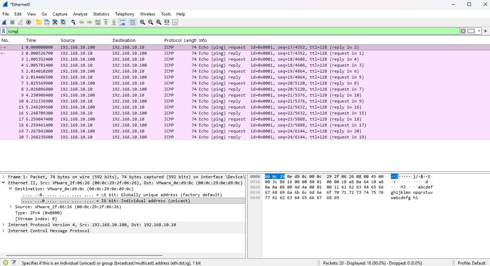
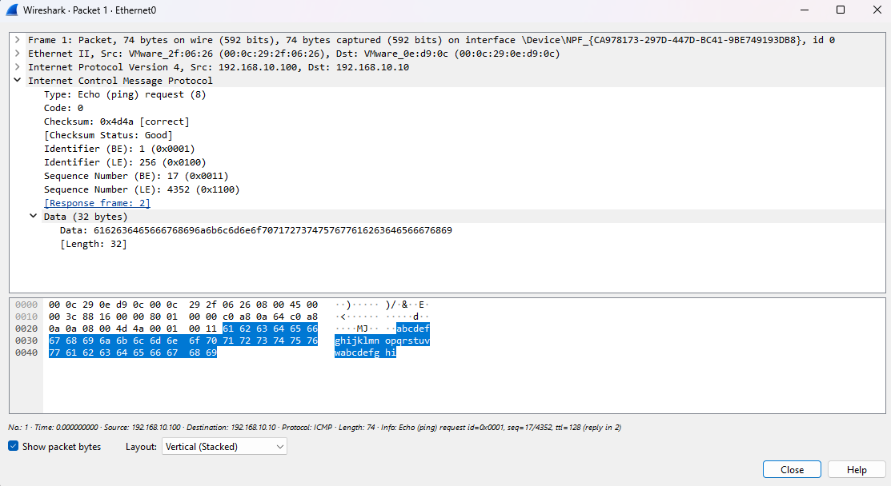

## Work in progress...

# Wireshark Basics

## Overview

Wireshark is a graphical network protocol analyzer used to capture and inspect network traffic. It provides detailed information about packets exchanged between systems and can help identify problems involving DNS resolution, TCP connections, application communication, and other network protocols.

Unlike command-line tools such as `ping`, `traceroute`, `ss`, or `Test-NetConnection`, Wireshark allows individual packets to be examined in detail.

This makes it useful when basic connectivity tests show that a problem exists but do not explain what is happening at the packet level.

# Key Concepts

## Packet Capture

A packet capture records network traffic observed by a network interface.

Packet captures are commonly stored as `.pcap` or `.pcapng` files and can be reopened later for analysis.

## Protocol Dissection

Wireshark interprets packet contents according to known network protocols. This allows raw network data to be displayed as recognizable protocol fields rather than only hexadecimal data.

## TCP Three-Way Handshake

TCP uses a three-step process to establish a connection:

```text
SYN → SYN/ACK → ACK
```

Examining this sequence is one of the most useful techniques for troubleshooting TCP connectivity.

## Source and Destination

Each packet identifies where the traffic originated and where it is going.

For IP traffic, this includes source and destination IP addresses. TCP and UDP traffic also includes source and destination port numbers.

## Encrypted Traffic

Wireshark can capture encrypted traffic such as HTTPS, but the application payload is normally unreadable without access to the appropriate encryption information.

Even when payload data is encrypted, Wireshark can still provide useful information about:

* IP addresses
* TCP ports
* Connection establishment
* Connection termination
* Retransmissions
* Packet timing

---

# Common Display Filters

| Filter                        | Purpose                                     |
| ----------------------------- | ------------------------------------------- |
| `icmp`                        | Display ICMP traffic                        |
| `dns`                         | Display DNS traffic                         |
| `tcp`                         | Display TCP traffic                         |
| `udp`                         | Display UDP traffic                         |
| `tcp.port == 443`             | Display TCP traffic on port 443             |
| `ip.addr == 8.8.8.8`          | Display traffic involving a specific IP     |
| `ip.src == 192.168.1.10`      | Display packets from a specific source      |
| `ip.dst == 192.168.1.10`      | Display packets to a specific destination   |
| `tcp.flags.syn == 1`          | Display TCP packets containing the SYN flag |
| `tcp.flags.reset == 1`        | Display TCP reset packets                   |
| `tcp.analysis.retransmission` | Display TCP retransmissions                 |

## Usage

Wireshark can be used to:

* Capture network traffic from a selected interface
* Inspect individual packets and protocol fields
* Troubleshoot DNS queries and responses
* Analyze TCP connection establishment and failures
* Identify retransmissions, resets, and other TCP issues
* Examine HTTP and other unencrypted application traffic
* Determine which systems and protocols are communicating
* Compare expected network behavior with failed connections

## Starting a Packet Capture

When Wireshark starts, it displays the available network interfaces.

On a Windows system, these may include:

* Ethernet adapters
* Wi-Fi adapters
* Virtual network adapters
* Loopback interfaces

Select the interface carrying the traffic that needs to be analyzed.

For example, if the system is using the `Ethernet0` interface:

1. Open Wireshark.
2. Select **Ethernet0** from the interface list.
3. Double-click the interface to begin capturing packets.
4. Generate the traffic that needs to be tested.
5. Click the red **Stop** button when enough traffic has been captured.

Limiting the duration of the capture makes the resulting packet trace easier to analyze.

Wireshark user interface on Windows 11 Professional.

  


---

## Capture Filters and Display Filters

Wireshark supports two different types of filters.

### Capture Filters

Capture filters determine which packets Wireshark records.

They are configured **before or while starting a capture** and use Berkeley Packet Filter (BPF) syntax.

| Capture Filter | Purpose |
|---|---|
| `host 8.8.8.8` | Capture traffic to or from a specific host |
| `port 53` | Capture traffic using port 53, commonly DNS |
| `tcp port 443` | Capture TCP traffic using port 443, commonly HTTPS |
| `icmp` | Capture ICMP traffic such as `ping` |


Capture filters are useful when a system generates large amounts of traffic and only specific packets are required.

### Display Filters

Display filters determine which packets are displayed from an existing capture.

They do not remove packets from the capture file.

Examples:

| Display Filter | Purpose |
|---|---|
| `dns` | Display DNS traffic |
| `icmp` | Display ICMP traffic |
| `tcp` | Display TCP traffic |
| `tcp.port == 443` | Display TCP traffic using port 443 |
| `ip.addr == 8.8.8.8` | Display packets where the specified IP address is either the source or destination |
| `tcp.flags.reset == 1` | Display TCP reset packets |

For general troubleshooting, it is often useful to capture normally and then use **display filters** to narrow the results.

---

# Practical Examples

## Example 1: Analyze Ping Traffic

Start a Wireshark capture and run:

```
ping 192.168.10.10
```

Apply the following display filter:

```
icmp
```

A successful ping should show pairs of:

* ICMP Echo Request packets
* ICMP Echo Reply packets

This confirms that ICMP traffic is successfully travelling between the systems.

If requests are visible but replies are not received, the problem may involve routing, filtering, firewall rules, or the remote system.

 

 


